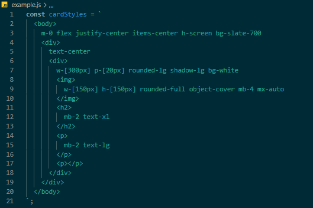

# SXML
A new way to style websites. Use XML to specify your styles.


## How it works

Using a regular HTML file you can define your content as usual. Then, using a JS file, you can define your styles in a XML format similar to HTML (currenlty it uses the built in DOM parser but that will change to a custom XML schema).

<div style="display:flex;">
  <div style="width:50%;padding:5px;">
    

  </div>
  <div style="width:50%;padding:5px;">
    

  </div>
</div>

The entry point of the styles is defined in the HTML file, with the "root" attribute, seen in the left in the body tag. Then the styles are applied via the implementStyles function:

```js
  implementStyles(cardStyles, "example.html", "userCard");
```

Then the results can be seen by opening the HTML file in the browser:
