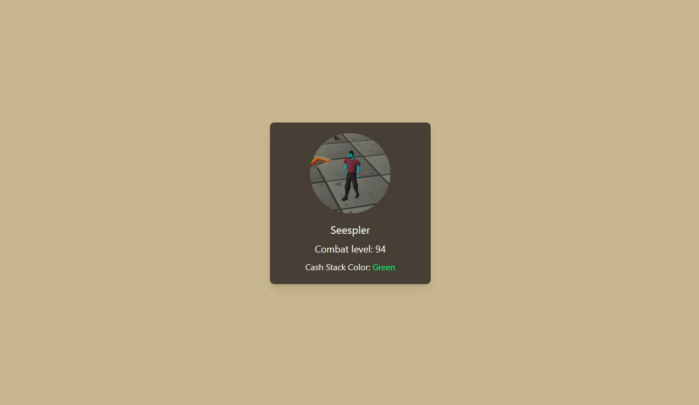

# Styled Markup Language (SML)
A new way to style websites. Use XML to specify your styles.


## How it works

Using a regular HTML file you can define your content as usual. Then, using a JS file, you can define your styles in a XML format similar to HTML (currenlty it uses the built in DOM parser but that will change to a custom XML schema).

##### example.html
```html
<body root="userCard">
  <div>
    <div>
      
      <h2>Seespler</h2>
      <p>Combat level: 94</p>
      <p>Cash Stack Color: Green</p>
    </div>
  </div>
  <script src="./example.js"></script>
</body>
```
##### example.js
```js
const cardStyles = `
  <body>
    m-0 flex justify-center items-center h-screen bg-slate-700 
    <div>
      text-center 
      <div>
        w-[300px] p-[20px] rounded-lg shadow-lg bg-white 
        
          w-[150px] h-[150px] rounded-full object-cover mb-4 mx-auto
        </img>
        <h2>
          mb-2 text-xl
        </h2>
        <p>
          mb-2 text-lg
        </p>
        <p></p>
      </div>
    </div>
  </body>
`;
```

The entry point of the styles is defined in the HTML file, with the "root" attribute, seen in the HTML code in the body tag. Then the styles are applied via the implementStyles function:

```js
  implementStyles(cardStyles, "example.html", "userCard");
```

Then the results can be seen by opening the HTML file in the browser:



### Notes
- This is currently just something I thought would be interesting, not meant to be a production level idea at this point.
- I used the Tailwind CSS CDN to quickly hack together a proof of conecpt for this idea.


